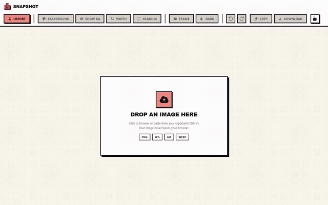
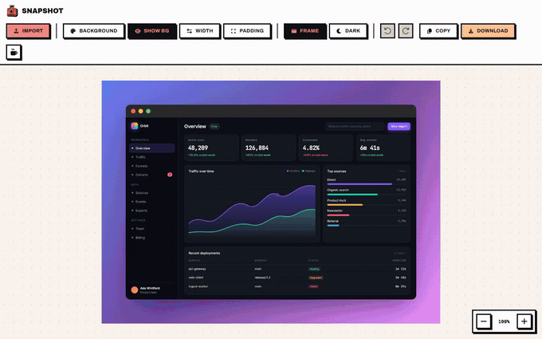
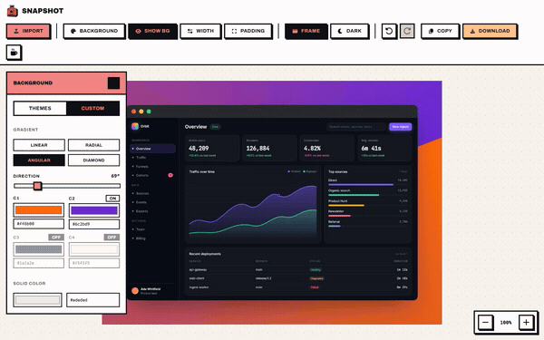
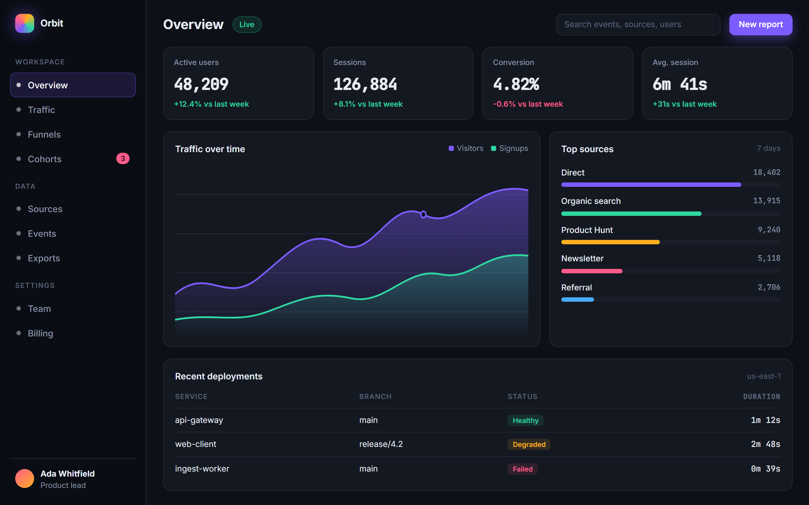
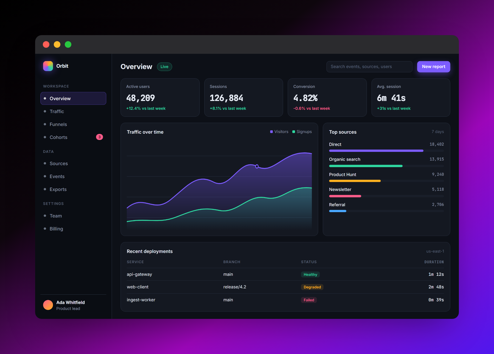
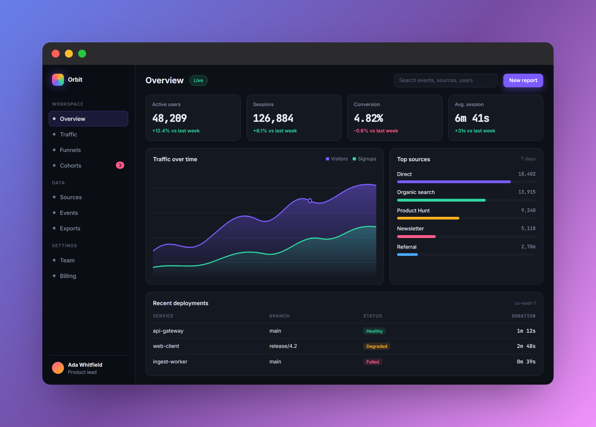
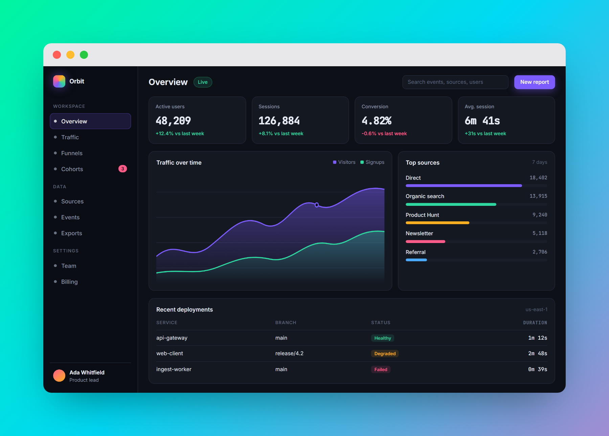
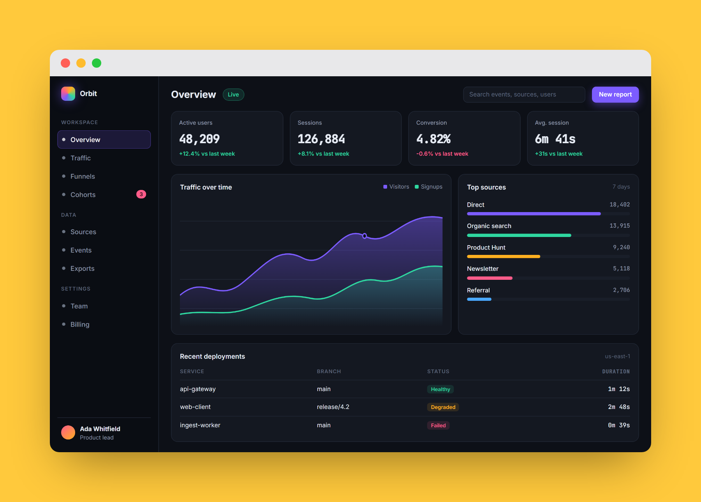
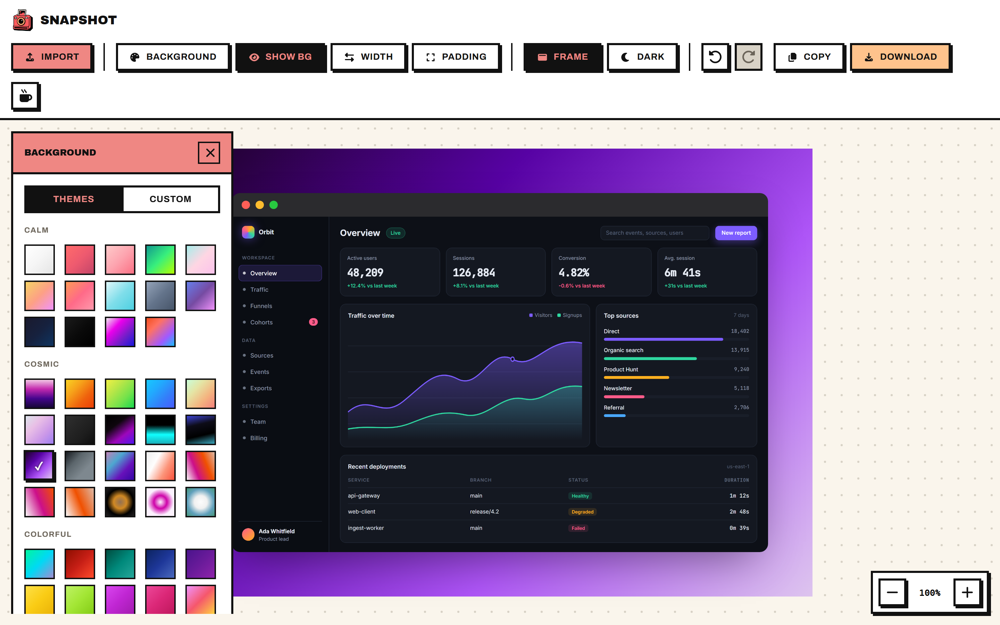
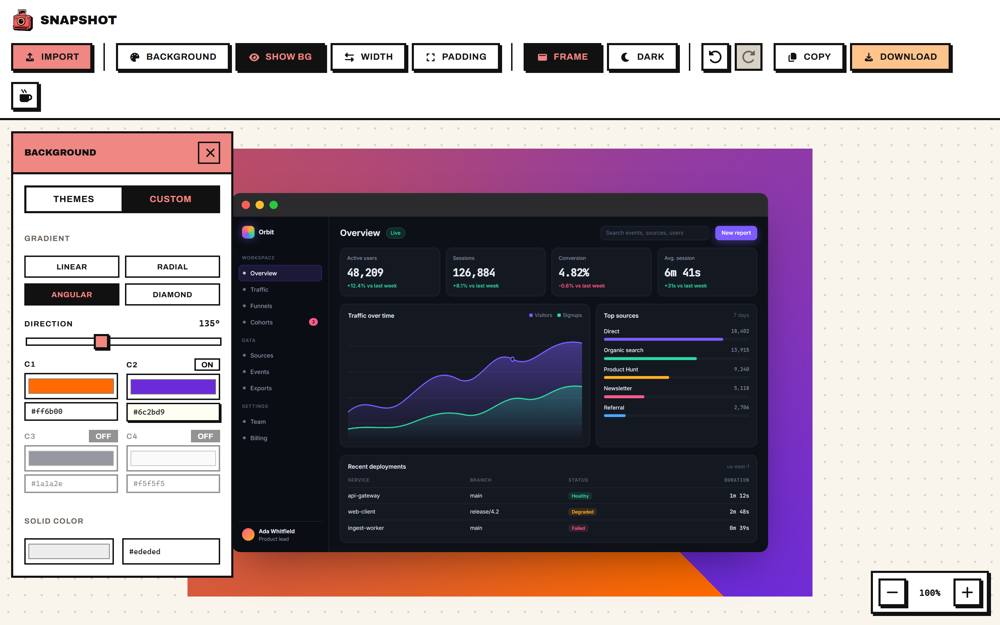

<div align="center">


# Snapshot

**Beautiful screenshots, in seconds.**

Drop a screenshot, set it on a gorgeous background, frame it like a real macOS
window, export a high-resolution PNG. Free, no account, no watermark, and 100%
in your browser: the image never leaves your machine.

[**Open the app**](https://valtielchan.github.io/snapshot/) &nbsp;·&nbsp;
[Buy me a coffee](https://ko-fi.com/valtiel_)

[](LICENSE)
[](https://github.com/ValtielChan/snapshot/actions/workflows/deploy.yml)


</div>

---

## See it work

Import, background, custom gradient, padding, width, frame, undo, export.
One take, no cuts.



<details>
<summary><b>Watch the full-resolution video (1280p, 60s)</b></summary>

<video src="https://github.com/ValtielChan/snapshot/raw/main/docs/media/demo.mp4" controls width="100%"></video>

If your browser does not play it inline:
[download demo.mp4](https://github.com/ValtielChan/snapshot/raw/main/docs/media/demo.mp4).

</details>

### 156 backgrounds, one click each



### Padding, width, frame, all live



## What comes out

Before and after, nothing else touched:

| Raw screenshot | Exported by Snapshot |
|:--:|:--:|
|  |  |

Same screenshot, four looks. These are unedited PNGs exported by the app.

| | |
|:--:|:--:|
|  |  |
|  |  |

## Inside the editor

| Background library | Custom gradient builder |
|:--:|:--:|
|  |  |

## Features

- **Import** by drag and drop, file picker, or clipboard paste (`Ctrl+V`)
- **156 backgrounds** across 7 families, gradients and solid colors
- **Custom gradients**: linear, radial, angular, diamond, with adjustable
  direction, 2 to 4 hideable colors, hex input, or a flat fill
- **macOS window frame**, light or dark, with a soft drop shadow
- **Pixel-precise width and padding**, zoom, unlimited undo and redo
- **Export** a 2x PNG: download it, or copy it straight to the clipboard
- **Neo-brutalist UI**: coral `#EF8783` and peach `#FFC38C`, hard shadows,
  zero rounded corners

## Privacy

There is no backend. No upload, no account, no cookie, no analytics, no
network call of any kind. Your image is read by the browser, composed in the
DOM, and rasterized locally by `html-to-image`. Close the tab and nothing
remains anywhere.

## Stack

React 18 + Vite, Zustand for state and undo history, html-to-image for the
export, Font Awesome for icons. Fully static build, hosted on GitHub Pages.

## Development

```bash
cd frontend
npm install
npm run dev        # http://localhost:5173/snapshot/
```

```bash
npm run build      # production build in frontend/dist
npm run preview    # serve that build on http://localhost:4173/snapshot/
```

In VS Code, `Ctrl+Shift+B` runs the dev server.

## Deployment

Every push to `main` triggers the GitHub Actions workflow
([.github/workflows/deploy.yml](.github/workflows/deploy.yml)), which builds
the app and publishes it to GitHub Pages.

## Project layout

```
frontend/src/
├── App.jsx            # routes: / (landing), /editor, /design
├── styles/            # design system tokens + base
├── ui/                # reusable neo-brutalist components
├── editor/            # the editor: scene, toolbar, backgrounds, export
└── pages/             # landing + design system showcase

docs/media/            # showcase assets, regenerated by scripts/record-demo.mjs
scripts/               # demo fixture + Playwright recording script
```

The showcase above is reproducible. `scripts/demo-app.html` is the fake
dashboard used as demo input, and `scripts/record-demo.mjs` drives the real
app with Playwright to record the video, the GIFs and every screenshot:

```bash
npm install && npx playwright install chromium   # once, at the repo root
cd frontend && npm run build && npm run preview  # in another terminal
npm run demo                                     # needs ffmpeg on the PATH
```

## License

[MIT](LICENSE). Do what you want with it.
